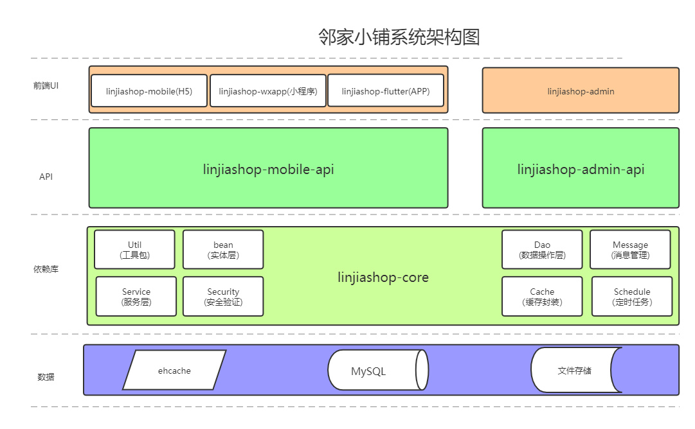

# 开发指南

## 系统架构图

## 项目模块
- linjiashop-admin PC端后台管理的前端网页
- linjiashop-admin-api PC端后台管理的api服务
- linjiashop-mobile 手机商城的前端网页
- linjiashop-mobile-api 移动端商城的api服务（h5,小程序，app都用改api服务作为后台接口）
- linjiasho-wxapp 微信小程序商城
- linjiashop-core 基础模块，包括工具类，dao，service，bean等内容
- linjiashop-generator 代码生成模块,根据实体生成dao,service,后台管理的controller和页面,配合IDEA 代码生成插件[webflash-generator](https://plugins.jetbrains.com/plugin/12648-webflash-generator)使用效果更好

## 基础模块
基础模块主要包含下面两个子模块：
- linjiashop-core 基础模块
- linjiashop-generator 代码生成模块,如果不使用代码生成功能，可以删除掉该模块

### linjiashop-core
- linjiashop-core是项目的核心模块，分别被两个api模块依赖：linjiashop-admin-api(后台管理服务)和linjiashop-mobile-api(用户端接口服务)
- 该模块拷贝自[web-flash](http://enilu.gitee.io/web-flash)的flash-core模块。在flash-core模块的基础上增加了业务相关的entity，repository,service
- 该模块是一个基于Spring Boot的标注jar模块，主要依赖了以下核心库：
    - Spring Boot相关:web,jpa,jdbc
    - alibaba druid作为数据源
    - ehcache 作为本地缓存;这里之所以没有使用redis，主要是为了减小开发测试的复杂度.方便开发
    - shiro和jwt作为基础的权限模块，linjiashop-core封装了权限基础内容，然后在两个api服务中分别配置自己的权限过滤规则
    - quartz 来完成定时任务功能
    - 一些util工具包：Guava,fastjson,Apache Commons系列工具包
    - jxls 来做导出excel功能，可以根据配置好的excel模板生成excel表格
    - Lombok用来生成实体的set，get方法，所以将本项目导入开发环境后，需要先保证开发工具安装了Lombok插件
- 该模块封装了常用的增删改查操作，基本上能满足日常90%的数据库操作需求，因此在自定义service方法或者repository方法的时候最好先看看封装的BaseService和BaseRepository是否已经有方法可以满足业务需要
## 后台管理
后台管理功能有两部分组成：linjiashop-admin(后台管理界面)和linjiashop-admin-api(后台管理api服务)
- linjiashop-admin 是一个基于[Vue.js](https://cn.vuejs.org/)&[Element](https://element.eleme.cn/#/zh-CN)的前端项目
- linjiashop-admin-api是一个基于Spring Boot的后端web服务

### linjiashop-admin
- linjiasho-admin的基础功能克隆自[web-flash](http://enilu.gitee.io/web-flash)的flash-vue-admin目录
- 后台管理的基础通用模块(非业务模块)请参考web-flash的在线文档，包括国际化，缓存的使用，定时任务管理，消息管理(短信，邮件模板配置，消息发送),导出excel，权限，日志，字典等等
- linjiashop-admin在flash-vue-admin的基础上新增了商城模块，商城模块主要包括如下功能
    - 商品类别维护
    - 商品维护
    - 购物车列表
    - 订单管理
    - 前端用户管理

### linjiashop-admin-api
- 该模块为linjiashop-admin提供数据接口服务
- 开发过程中可以通过swagger来调试接口，通过swagger提供了在线测试工具，项目启动后，可以访问https://ip:端口/swagger-ui.html,比如本项目演示环境的api测试地址为：[http://linjiashop-admin-api.microapp.store/swagger-ui.html](http://linjiashop-admin-api.microapp.store/swagger-ui.html)
    - 测试的时候，需要先调用/account/login登录系统并获取token，然后调用每个接口测试的时候将token放进去
    - 如果要定义自己的过滤规则，可以通过修改：cn.enilu.flash.api.config.ShiroConfig中的配置来实现。
   

## 用户端系统
用户端系统包括两部分，

- linjiashop-mobile-api 数据接口服务
- 用户端，目前提供了三端：
    - linjiasho-mobile（手机H5），
    - linjiashop-wxapp（微信小程序）,
    - linjiashop-flutter(app),由于app项目特殊性，单独放在另外一个仓库[gitee](https://gitee.com/microapp/linjiashop-flutter),[github](https://github.com/microapp-store/linjiashop-flutter)

### linjishop-mobile-api
**用户端api由于是一个api提供三端(H5,小程序,app)使用，所以开发过程中要考虑兼容性**
- 比如banner设计，就不能简单的配置个url就行了,h5通过url可以打开一个界面，但是小程序不方便打开外部链接，就必须做具体的界面来展示banner信息。诸如此类接口要考虑全面。
- 目前系统还在开发中，为避免接口复杂化，所以接口并没有添加版本号。但是在真实产品中，需要考虑到app有不同的版本，接口也不能简单粗暴的调整，应该增加版本管理。
- 用户端接口和后台管理的接口有一些区别，区别在于：后台管理所有操作都必须登录才能操作，而用户端则有可以不登录就可以获取的数据接口，针对这块mobiel-api中做如下设计：
    - /user开头的数据请求都必须登录才可以请求，
    - 如果用户没有登录就获取/user开头的接口，会返回401，
    - 用户端系统回自动判断如果收到401则跳转至登录界面
- 如果你对上述规则有自己的想法可以进行在cn.enilu.flash.config.ShiroConfig中进行调整，当然调整后要确保前端项目也做好适配
- mobile-api和admin-api公用了linjiashop-core模块，也即公用了entity,repository,service层的代码，因此在调整这些代码的时候要确保和后台管理不要有冲突，尤其是service层的代码
    

## linjiashop-mobile
- linjiashop-mobile 使用了有赞vant作为ui组件，开发过程请参考有赞vant的[官方文档](https://youzan.github.io/vant/#/zh-CN/intro)
- linjiashop-mobile 是一个标注你得使用vue.js构建的前端项目，有问题翻vue.js和vant的官方文档和issue

## linjiashop-wxapp
- linjiashop-wxapp 使用mpvne作为基础框架，使用vant-weapp作为ui框架，开发过程请参考这两个开源组件的官方文档和issue，这两个项目都是很成熟的开源项目，基本上开发过程遇到的问题翻一翻官方文档和issue都能解决。[mpvue](http://mpvue.com),[vant-weapp](https://youzan.github.io/vant-weapp/#/)
- 由于小程序的限制，所以并不是所有vue.js的特性都能用在小程序中，因此开发之前强烈建议把mpvue的官方文档先看一遍（本身也不多），主要是把mpvue开发小程序和vue.js开发的一些区别了解下。免得后期遇到莫名其妙的问题手足无措。[mpvue模板语法](http://mpvue.com/mpvue/#%E6%A8%A1%E6%9D%BF%E8%AF%AD%E6%B3%95)

## app商城
- app商城由于其特殊性并没有和本项目其他功能放在一个项目目录下，而是放在单独一个仓库，仓库地址：仓库地址[gitee](https://gitee.com/microapp/linjiashop-flutter),[github](https://github.com/microapp-store/linjiashop-flutter)
- app 商城采用flutter1.9开发,安装flutter的时候切记要安装指定的版本。开发之前请认真阅读linjiashop-flutter的readme文档

## 开发约定
- 本项目主要技术栈为Spring Boot2,Spring Data Jpa,Vue.js，Flutter。所以开发过程中请首选遵循已上技术官方的一些约定
- 本项目开发过程使用了Lombok插件来生成bean的set，get方法。所以请务必为开发工具安装lombok插件，以避免项目中实体由于没有set，get方法无法编译的问题。
- 本项目封装了service和repository的常用操作方法到基类；新建service和repository应继承这两个父类：BaseService,和BaseRepository
- 本项目封装了BaseEntity和ShopBaseEntity 两个实体类的基类。其他实体类都应该继承这两个实体中的一个，具体继承哪个请参考下面建议
    - BaseEntity比ShopBaseEntity多了createBy和modifyBy两个字段。
    - BaseEntity主要用在系统基础功能相关实体，比如系统参数Cfg,定时任务实体Task等；这类实体的数据维护主要在后台管理系统中维护，因此配合注解：@EntityListeners(AuditingEntityListener.class) 可以在维护的时候自动设置其维护人信息
    - ShopBaseEntity主要跟前端用户操作相关的实体相关，比如订单，购物车等信息，这类信息一般不需要自动设置维护人信息，而是通过idUser跟前端用户关联.
- 本项目开发运行设计相关软件版本如下：
    - Tomcat8及其已上
    - MySQL5.6及其已上
    - Jdk1.8及其已上

